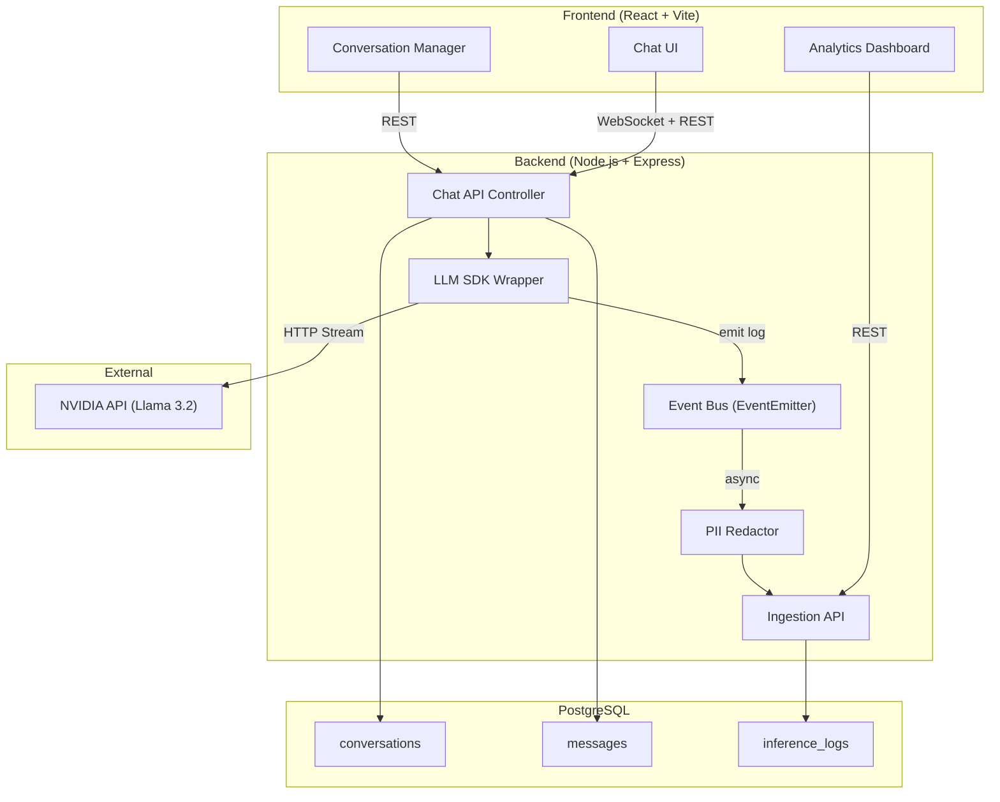

# LLM Inference Logger & Ingestion System

Build a production-grade inference logging system for LLM applications with a chatbot, SDK wrapper, ingestion pipeline, metrics dashboards, and Docker Compose deployment.

## Architecture Overview



## Tech Stack

| Layer | Technology | Rationale |
|-------|-----------|-----------|
| Frontend | React 19 + Vite | Fast dev, modern tooling |
| Styling | Vanilla CSS (premium dark theme) | Full control, no framework lock-in |
| Backend | Node.js + Express | Lightweight, streaming support |
| Database | PostgreSQL 16 | Relational integrity, JSON support |
| ORM | Knex.js | Lightweight query builder, migrations |
| LLM Provider | NVIDIA API (meta/llama-3.2-11b-vision-instruct) | As specified |
| Real-time | Server-Sent Events (SSE) | Native streaming for chat |
| Containerization | Docker Compose | One-command setup |

## Proposed Changes

### 1. Project Root Setup

#### [NEW] docker-compose.yml
- PostgreSQL 16 service with health checks
- Backend service with env injection
- Frontend service (Vite dev or Nginx prod)
- Shared network, volume for DB persistence

#### [NEW] .env.example
- All environment variables documented
- NVIDIA API key, DB credentials, ports

#### [NEW] README.md
- Setup instructions, architecture overview, schema design, tradeoffs

---

### 2. Database Schema (PostgreSQL + Knex Migrations)

#### [NEW] backend/migrations/001_create_conversations.js
```sql
CREATE TABLE conversations (
    id UUID PRIMARY KEY DEFAULT gen_random_uuid(),
    title VARCHAR(255),
    status VARCHAR(20) DEFAULT 'active',  -- active | cancelled | completed
    created_at TIMESTAMPTZ DEFAULT NOW(),
    updated_at TIMESTAMPTZ DEFAULT NOW()
);
```

#### [NEW] backend/migrations/002_create_messages.js
```sql
CREATE TABLE messages (
    id UUID PRIMARY KEY DEFAULT gen_random_uuid(),
    conversation_id UUID REFERENCES conversations(id) ON DELETE CASCADE,
    role VARCHAR(20) NOT NULL,  -- user | assistant | system
    content TEXT NOT NULL,
    created_at TIMESTAMPTZ DEFAULT NOW()
);
CREATE INDEX idx_messages_conversation ON messages(conversation_id, created_at);
```

#### [NEW] backend/migrations/003_create_inference_logs.js
```sql
CREATE TABLE inference_logs (
    id UUID PRIMARY KEY DEFAULT gen_random_uuid(),
    conversation_id UUID REFERENCES conversations(id),
    message_id UUID REFERENCES messages(id),
    
    -- Provider metadata
    model VARCHAR(100) NOT NULL,
    provider VARCHAR(50) NOT NULL,
    
    -- Performance metrics
    latency_ms INTEGER,
    prompt_tokens INTEGER,
    completion_tokens INTEGER,
    total_tokens INTEGER,
    time_to_first_token_ms INTEGER,
    
    -- Request metadata
    status VARCHAR(20) NOT NULL,  -- success | error | cancelled
    error_message TEXT,
    request_timestamp TIMESTAMPTZ NOT NULL,
    response_timestamp TIMESTAMPTZ,
    
    -- Previews (PII-redacted)
    input_preview TEXT,
    output_preview TEXT,
    
    -- Raw metadata (JSONB for flexibility)
    raw_metadata JSONB,
    
    created_at TIMESTAMPTZ DEFAULT NOW()
);
CREATE INDEX idx_logs_conversation ON inference_logs(conversation_id);
CREATE INDEX idx_logs_timestamp ON inference_logs(request_timestamp);
CREATE INDEX idx_logs_status ON inference_logs(status);
```

**Schema Design Decisions:**
- UUIDs for all primary keys (distributed-friendly)
- `TIMESTAMPTZ` for all timestamps (timezone-aware)
- JSONB `raw_metadata` for extensibility without schema changes
- Separate `input_preview` / `output_preview` (PII-redacted, truncated)
- Indexes on conversation_id, timestamp, status for dashboard queries

---

### 3. Backend - LLM SDK Wrapper

#### [NEW] backend/src/sdk/llm-client.js
The core SDK wrapper that intercepts all LLM calls:
- Wraps NVIDIA API calls with automatic metadata capture
- Measures latency (total, time-to-first-token)
- Captures token usage from response headers/body
- Supports streaming (SSE) and non-streaming modes
- Emits structured log events via EventBus
- Handles errors gracefully with error classification

#### [NEW] backend/src/sdk/event-bus.js
Event-based architecture using Node.js EventEmitter:
- `inference.start` — fired when LLM call begins
- `inference.token` — fired on each streaming token
- `inference.complete` — fired when LLM call completes
- `inference.error` — fired on errors
- Decouples logging from inference path (non-blocking)

#### [NEW] backend/src/sdk/pii-redactor.js
Basic PII redaction for input/output previews:
- Email addresses → `[EMAIL]`
- Phone numbers → `[PHONE]`
- SSN patterns → `[SSN]`
- Credit card numbers → `[CC]`
- Custom pattern support

---

### 4. Backend - Ingestion Pipeline

#### [NEW] backend/src/ingestion/ingestion-service.js
- Receives structured log events from EventBus
- Validates payload schema (required fields check)
- Extracts and normalizes metadata
- Applies PII redaction to previews
- Batch-inserts into PostgreSQL (with configurable flush interval)
- Circuit breaker for DB failures (logs don't block chat)

#### [NEW] backend/src/ingestion/ingestion-controller.js
REST endpoints for the ingestion API:
- `POST /api/ingest` — receive logs from SDK
- `GET /api/logs` — query logs with filters (time range, status, model)
- `GET /api/logs/stats` — aggregated metrics for dashboard
- `GET /api/logs/:id` — single log detail

---

### 5. Backend - Chat API

#### [NEW] backend/src/chat/chat-controller.js
- `POST /api/conversations` — create new conversation
- `GET /api/conversations` — list all conversations
- `GET /api/conversations/:id` — get conversation with messages
- `PATCH /api/conversations/:id` — update status (cancel/resume)
- `DELETE /api/conversations/:id` — delete conversation
- `POST /api/conversations/:id/messages` — send message (returns SSE stream)

#### [NEW] backend/src/chat/chat-service.js
- Manages conversation state
- Builds context window from recent messages (last N messages for context)
- Calls LLM SDK wrapper
- Streams response tokens back via SSE
- Supports cancellation via AbortController

---

### 6. Backend - Server Setup

#### [NEW] backend/src/server.js
Express app with:
- CORS configuration
- JSON body parser
- SSE middleware
- Error handling middleware
- Health check endpoint
- Graceful shutdown

#### [NEW] backend/package.json
Dependencies: express, knex, pg, axios, uuid, cors, dotenv

---

### 7. Frontend - React + Vite

#### [NEW] frontend/vite.config.js
- Proxy `/api` to backend
- HMR configuration

#### [NEW] frontend/src/App.jsx
Main layout with sidebar + main content area

#### [NEW] frontend/src/components/ChatView.jsx
- Message list with auto-scroll
- Input field with send button
- Streaming token display
- Cancel button for in-flight requests

#### [NEW] frontend/src/components/Sidebar.jsx
- Conversation list
- New conversation button
- Status indicators (active/cancelled/completed)
- Resume conversation action

#### [NEW] frontend/src/components/Dashboard.jsx
Metrics dashboard with:
- Total requests counter
- Average latency gauge
- P95 latency
- Error rate percentage
- Throughput over time (line chart)
- Token usage breakdown
- Status distribution (pie chart)

#### [NEW] frontend/src/components/ConversationList.jsx
- Filterable conversation list
- Status badges
- Timestamps
- Actions (cancel, resume, delete)

#### [NEW] frontend/src/index.css
Premium dark theme with:
- Glassmorphism cards
- Smooth gradients
- Micro-animations
- Custom scrollbar
- Inter/Outfit font from Google Fonts

---

## File Structure

```
ollive.ai-llm/
├── docker-compose.yml
├── .env.example
├── .env
├── README.md
├── backend/
│   ├── Dockerfile
│   ├── package.json
│   ├── knexfile.js
│   ├── migrations/
│   │   ├── 001_create_conversations.js
│   │   ├── 002_create_messages.js
│   │   └── 003_create_inference_logs.js
│   └── src/
│       ├── server.js
│       ├── db.js
│       ├── sdk/
│       │   ├── llm-client.js
│       │   ├── event-bus.js
│       │   └── pii-redactor.js
│       ├── ingestion/
│       │   ├── ingestion-service.js
│       │   └── ingestion-controller.js
│       └── chat/
│           ├── chat-service.js
│           └── chat-controller.js
├── frontend/
│   ├── Dockerfile
│   ├── package.json
│   ├── vite.config.js
│   ├── index.html
│   └── src/
│       ├── main.jsx
│       ├── App.jsx
│       ├── index.css
│       ├── api/
│       │   └── client.js
│       └── components/
│           ├── ChatView.jsx
│           ├── Sidebar.jsx
│           ├── Dashboard.jsx
│           └── MessageBubble.jsx
```

## Bonus Features Included

| Feature | Implementation |
|---------|---------------|
| ✅ Multi-provider support | SDK abstraction layer with provider config |
| ✅ Streaming responses | SSE from NVIDIA API → SSE to frontend |
| ✅ Dashboards | Latency, throughput, errors charts |
| ✅ Docker Compose | One-command `docker compose up` |
| ✅ Event-based architecture | Node.js EventEmitter for async logging |
| ✅ PII redaction | Regex-based redaction before storage |
| ✅ Conversation management | Cancel, list, resume conversations |

## Verification Plan

### Automated Tests
1. `docker compose up --build` — verify all services start
2. Backend health check: `GET /api/health`
3. Browser test: send chat messages, verify streaming responses
4. Dashboard: verify metrics update after chat interactions
5. Conversation management: create, cancel, resume, delete

### Manual Verification
- Open browser at `http://localhost:5173`
- Send messages and verify streaming works
- Check dashboard for metrics
- Test conversation cancel/resume

## Tradeoffs & Decisions

1. **Knex vs full ORM**: Chose Knex for lightweight query building — avoids ORM overhead while keeping migrations and type-safe queries
2. **EventEmitter vs message queue**: EventEmitter is sufficient for single-process; a real production system would use Redis/Kafka
3. **PII regex vs ML-based**: Regex patterns for speed; ML-based NER would be more accurate but adds latency
4. **PostgreSQL vs time-series DB**: PostgreSQL handles both relational data and time-series queries well enough at this scale
5. **SSE vs WebSocket**: SSE is simpler for unidirectional streaming (server → client); WebSocket would be needed for bidirectional real-time

## What I'd Improve With More Time

1. **Redis/Kafka** for event bus (horizontal scaling)
2. **Rate limiting** and API key management
3. **ML-based PII detection** (spaCy NER)
4. **Prometheus + Grafana** for infrastructure metrics
5. **Kubernetes deployment** with Helm charts
6. **Request/response replay** for debugging
7. **A/B testing** support in the SDK
8. **Webhook notifications** for error spikes
